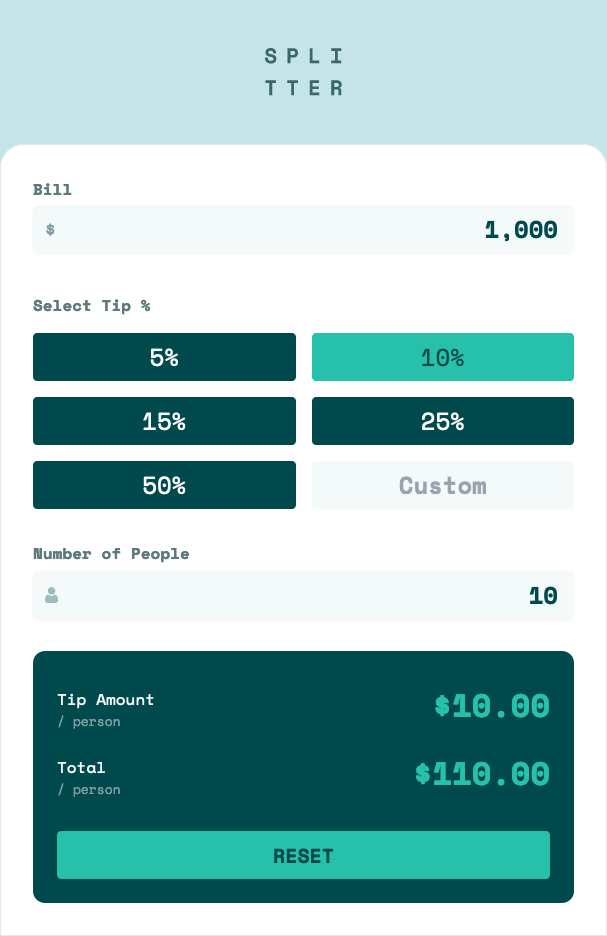
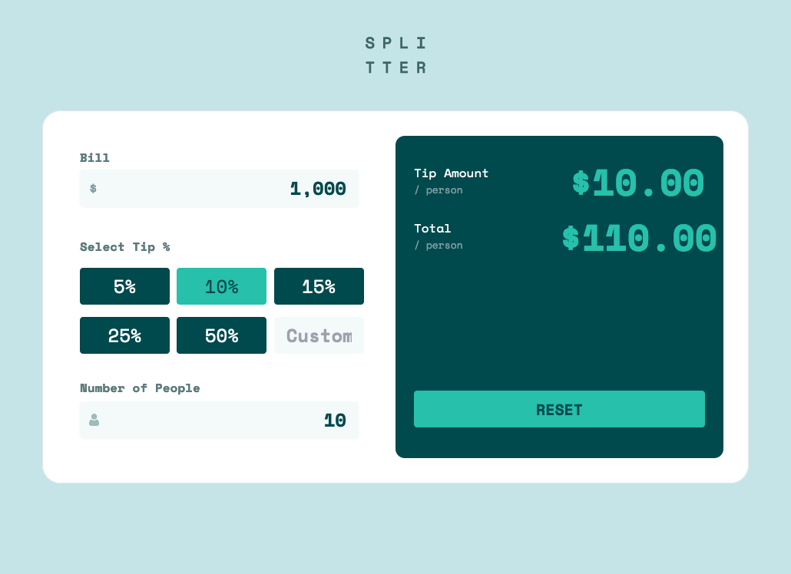

# Frontend Mentor - Tip calculator app solution

This is a solution to the [Tip calculator app challenge on Frontend Mentor](https://www.frontendmentor.io/challenges/tip-calculator-app-ugJNGbJUX). Frontend Mentor challenges help you improve your coding skills by building realistic projects.

## Table of contents

- [Overview](#overview)
  - [The challenge](#the-challenge)
  - [Screenshot](#screenshot)
  - [Links](#links)
- [My process](#my-process)
  - [Built with](#built-with)
  - [What I learned](#what-i-learned)
    - [ReactJS ignores setting input values to null](#reactjs-ignores-setting-input-values-to-null)
- [Continued development](#continued-development)
  - [Useful resources](#useful-resources)
- [Author](#author)

**Note: Delete this note and update the table of contents based on what sections you keep.**

## Overview

### The challenge

Users should be able to:

- View the optimal layout for the app depending on their device's screen size
- See hover states for all interactive elements on the page
- Calculate the correct tip and total cost of the bill per person

### Screenshot

### Mobile


### Desktop



### Links

- Solution URL: [Github](https://github.com/notapatch/tip_calculator)
- Live Site URL: [Tip calculator](https://tip-calculator-9femymyp8-richardwigley.vercel.app)

## My process

### Built with

- Semantic HTML5 markup
- CSS custom properties
- Flexbox
- CSS Grid
- Mobile-first workflow
- [React](https://reactjs.org/) - JS library
- [Tailwindcss](https://tailwindcss.com/docs) - For styles


### What I learned

#### ReactJS ignores setting input values to null 

Setting ReactJS does not set an input value to null. Instead, it ignores it and keeps the last value.
[NumberFormat ignores undefined and null.](https://github.com/s-yadav/react-number-format/issues/500#issuecomment-797342449)
[ReactJS open issue - Treat value={null} as empty string](https://github.com/facebook/react/issues/11417)

It is recommended to assign an empty string to reset inputs.
[Underlying all this is Javascript's inconsistent usage of null.](https://github.com/facebook/react/issues/11417#issuecomment-435649461)


### Continued development

#### Infinity Render

A common issue with ReactJS is the infinite redraw. I had this twice.
First time with the calculation of the tips when I put the calculated values in state.
Second time with testing if the reset button should be disabled and putting it into state.
In both cases I shouldn't have tried to store what could have been calculated, but
I didn't know how to solve it.

##### CalculatedAmounts

- by putting in calculateAmounts at the start of the app it was recalculated whenever one of the 
state variables changed and then passed to the Card that displayed the results.

```jsx
const output = calculateAmounts(bill, regularTip, customTip, people)

<CalculationCard output={output} .... >
```

##### CheckResetDisabled

- I had a test in the App called `checkResetDisabled`. It relies on closure making the state available to it.
It works but I only thought on what was happening when I reviewed the code.

```jsx

  // App.js
  
  const [bill, setBill] = useState("")
  const [regularTip, setRegularTip] = useState("")
  const [customTip, setCustomTip] = useState("")
  const [people, setPeople] = useState("")
  
  ...
  
  const checkResetDisabled = () => {
    // only works because it accesses outer variables
    return bill + regularTip + customTip + people === ""
  }
 
  ...
  
  <CalculationCard ... checkResetDisabled={checkResetDisabled}
  
  // CalculationCard.js
  
  function CalcuationCard(props) {
    ...
    <button
          className="h-12 w-full flex items-center justify-center text-alto-200 bg-cyan-200 hover:bg-cyan-100 text-xl font-bold rounded disabled:bg-granny-smith-300 disabled:text-granny-smith-400"
          onClick={props.handleClick}
          // Javscript allowing checkResetDisabled to access variables
          // where it was set up
          disabled={props.checkResetDisabled()}
    >
    ...
  }
```


### Useful resources

- [How to show an error message in React](https://www.educative.io/edpresso/how-to-show-an-error-message-in-react) - This is my second React project and I wanted a way to do this without libraries.

## Author

- Frontend Mentor - [@notapatch](https://www.frontendmentor.io/profile/notapatch)
- Twitter - [@yourusername](https://www.twitter.com/yourusername)
